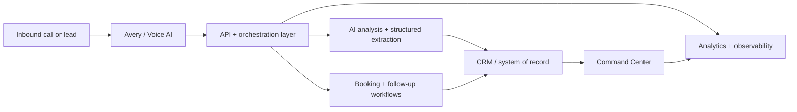

# DevHouse AI

[](https://github.com/emorban/devhouse-ai/actions/workflows/portfolio-ci.yml)

**Public engineering portfolio for DevHouse AI — an AI automation platform for service businesses.**

DevHouse AI connects voice AI, lead handling, CRM workflows, booking, follow-up, and operational visibility into one system. This repository is intentionally curated so hiring teams, technical partners, and collaborators can inspect the architecture and representative engineering work without exposing production credentials, customer data, or internal operations.

**Live product:** https://www.devhouseai.com

## Start here

- **[Product & engineering case study](./docs/CASE-STUDY.md)** — problem, architecture decisions, ownership, and verification philosophy
- **[Architecture overview](./docs/ARCHITECTURE.md)** — sanitized system map and boundaries
- **[Engineering highlights](./docs/ENGINEERING-HIGHLIGHTS.md)** — AI normalization, consent, reliability, and read/write separation
- **[Representative code](./samples)** — small sanitized implementation samples
- **[Executable tests](./tests)** — verification for the public samples

## What DevHouse AI does

- **Avery** — AI voice receptionist and lead-handling workflow
- **Command Center** — lead, workflow, and operational visibility
- **Lead orchestration** — capture, qualification, booking, and follow-up
- **CRM integration** — structured contact, company, opportunity, and activity flows
- **AI analysis** — call summarization, structured extraction, lead scoring, and next-action generation
- **Safety and reliability** — consent suppression, guarded writes, fallbacks, observability, and test gates

## System at a glance



The production system spans telephony/voice providers, AI model services, CRM, scheduling, Postgres-backed application state, analytics, and deployment monitoring. Provider-specific operational details are kept private.

## Engineering areas represented here

This public repository focuses on the parts that best demonstrate the engineering approach behind DevHouse AI:

- event and provider data normalization
- AI-assisted workflow orchestration
- consent and communication guardrails
- resilient provider fallback patterns
- CRM-facing domain models and workflow boundaries
- product/system architecture
- testing and production-readiness philosophy

## Selected stack

- Astro
- React
- TypeScript
- Tailwind CSS
- Vercel
- PostgreSQL / Neon
- Retell AI
- Twilio
- OpenAI
- Twenty CRM
- Playwright
- Vitest
- Sentry

## Run the public verification suite

The public samples are intentionally small, but they are executable rather than static snippets.

```bash
npm install
npm run verify
```

`verify` runs TypeScript type-checking and the Vitest suite covering provider normalization, consent classification, and fallback behavior.

## What I owned

I led DevHouse AI from product concept through system design and production iteration: defining the product architecture, deciding system boundaries and workflows, directing implementation, reviewing code and agent output, testing end-to-end behavior, and shipping product changes.

The work represented here is meant to show both product judgment and technical systems thinking — not just a marketing surface. See the **[case study](./docs/CASE-STUDY.md)** for a more detailed breakdown.

## Why the full repository is private

The production repository also contains operational runbooks, deployment and recovery procedures, internal readiness material, provider-specific monitors, environment configuration, and other information that should not be published with a portfolio.

This repository therefore contains **selected, sanitized examples** rather than a deployable copy of the production system.

## Repository guide

```text
docs/
  CASE-STUDY.md             # Product problem, architecture, ownership
  ARCHITECTURE.md           # High-level system architecture
  ENGINEERING-HIGHLIGHTS.md # Design and reliability decisions
samples/
  README.md                 # How the examples map to production patterns
  ai/                       # Structured AI/provider normalization
  consent/                  # Communication safety patterns
  reliability/              # Provider fallback / failure handling
tests/                      # Executable tests for public samples
.github/workflows/          # Public portfolio verification CI
SECURITY.md                 # Responsible disclosure guidance
NOTICE.md                   # Portfolio-use copyright notice
```

## Security boundary

This public portfolio must not contain:

- credentials, tokens, webhook secrets, or environment values
- customer or tenant data
- real phone numbers or private identifiers
- internal sales material
- incident/runbook procedures
- operational blocker/readiness documents
- private monitoring or recovery details

If you discover something that appears sensitive, please report it through the contact path at https://www.devhouseai.com rather than opening a public issue.

## Portfolio use

Source in this repository is published for inspection and evaluation. No open-source license is granted. See [`NOTICE.md`](./NOTICE.md).

---

**DevHouse AI · ELISON INC**
