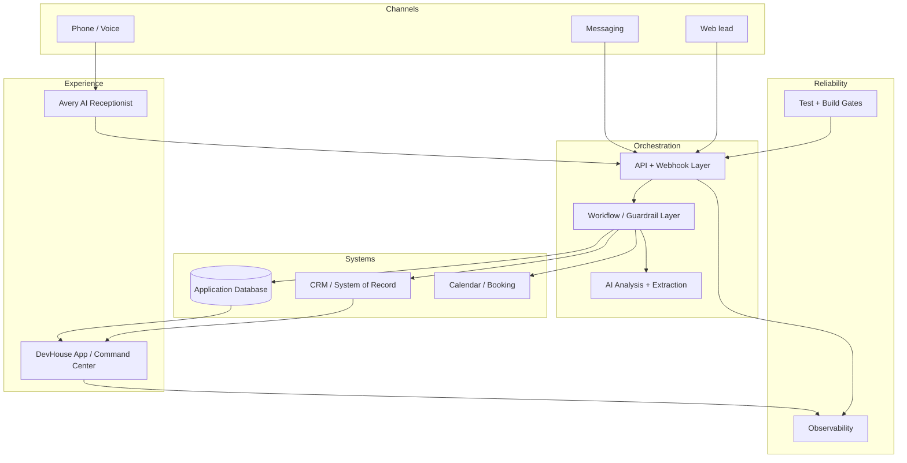

# DevHouse AI — Architecture Overview

This document describes the public, sanitized architecture of DevHouse AI. It intentionally omits production credentials, account identifiers, customer data, private endpoints, recovery procedures, and provider-specific operating details.

## Product shape

DevHouse AI is designed around a service-business front office: calls and leads arrive, Avery handles or assists with the interaction, structured data is produced, the CRM/system of record is updated, booking and follow-up workflows run, and the Command Center gives an operator a single view of what happened next.

## Architectural principles

### 1. Normalize providers at the boundary
External systems return different event shapes and naming conventions. DevHouse maps provider-specific payloads into internal domain objects before the rest of the application uses them. That reduces coupling and makes provider changes easier to absorb.

### 2. Treat communication as a guarded side effect
Outbound messaging and write actions should pass through explicit checks rather than being scattered across the application. Consent state, suppression rules, approval requirements, and environment configuration are treated as part of the action contract.

### 3. Keep a clear system of record
The UI should not invent operational truth. CRM and application state are normalized into view models so the Command Center renders traceable records rather than loosely assembled provider responses.

### 4. Prefer structured AI outputs
Where AI is used for post-call analysis or qualification, the system asks for structured outputs with known fields, validates/normalizes them, and maintains deterministic fallback behavior for degraded provider conditions.

### 5. Separate read paths from write paths
Read-only snapshots and monitoring are intentionally separated from actions that can change customer or operational state. This makes testing, auditing, and failure handling safer.

### 6. Design for degraded operation
A provider or model outage should not automatically make the entire workflow unusable. The application uses fallback paths and explicit failure states rather than assuming every dependency is always available.

## Representative technology

The production system has used Astro, React, TypeScript, Tailwind CSS, Vercel, PostgreSQL/Neon, Retell AI, Twilio, OpenAI, Twenty CRM, Playwright, Vitest, and Sentry.

The exact production topology and environment-specific wiring are intentionally not included in this public repository.

## Public vs. private boundary

Public here:

- architecture concepts
- sanitized engineering examples
- domain-model patterns
- consent and reliability patterns
- selected implementation excerpts

Private in production:

- credentials and environment values
- tenant/customer records
- internal runbooks and recovery procedures
- operational monitors/proofs
- provider account identifiers and phone numbers
- detailed readiness/blocker material
